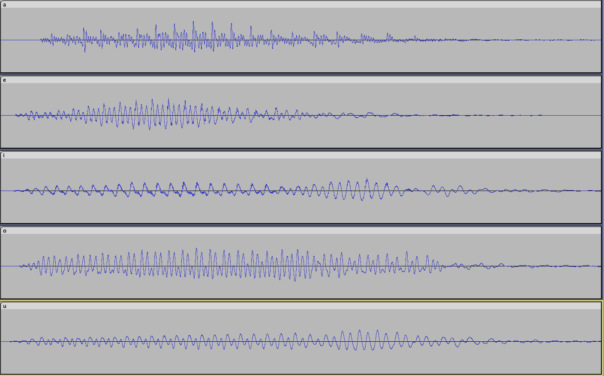

Inregistrati-va in timp ce spuneti, pe rand, vocalele "a, e, i, o, u" si deschideti fisierul in Audacity pentru a putea vedea spectograma (sau folositi o aplicatie de telefon care va poate afisa spectograma in timp real). Puteti distinge diferitele vocale pe baza ei? 

Rezolvare:

Vocalele pot fi distinse daca spectograma este marita suficient de mult. Pe o spectograma mai micsorata, vocalele i si u sunt foarte similare, si la fel si vocalele e si o. 